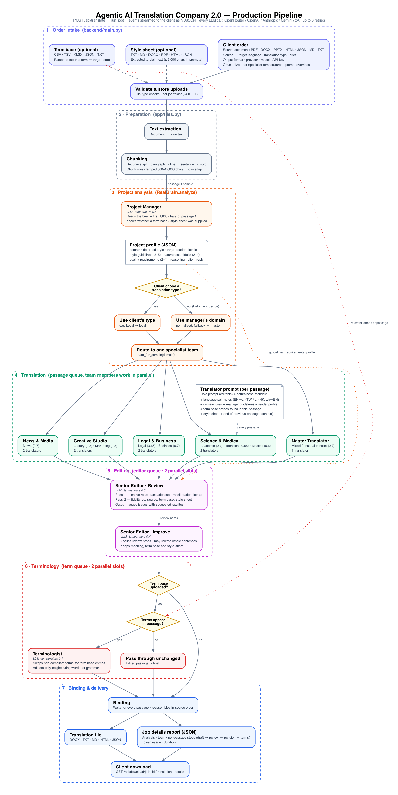

# Agentic AI Translation Company 2.0


A cosy, real-time **pixel-art translation company**. Place an order in the top half of the page, then watch the Manager, specialist translators, Editor, Terminologist, Chunk-o-matic and Receptionist act it out in a 2.5D office below.

Built on the [v1 agentic translation pipeline](https://github.com/Max-Lee-explore/agentic-ai-translation-company), rewritten for parallel specialist teams, a streaming event pipeline, natural-sounding output and a live office scene.

## Quick start

Open **two terminals**:

**Backend** (http://localhost:8000)

```bash
cd backend
python3 -m venv .venv
source .venv/bin/activate   # Windows: .venv\Scripts\activate
pip install -r requirements.txt
uvicorn main:app --reload
```

**Frontend** (http://localhost:5173)

```bash
cd frontend
npm install
npm run dev
```

Open http://localhost:5173. Without an API key the app runs in **Demo mode**: the office still animates, but no AI is called.

## Using it

1. Open **Settings** (menu, top right) and paste an API key for OpenRouter, OpenAI, Anthropic, Google Gemini or xAI.
2. Optionally edit each role's prompt under **Agent system prompts** (saved in your browser, sent with live jobs).
3. Upload a document (or click **Try a sample job**), plus an optional term base and style sheet.
4. Pick languages, translation type and write a brief for the Manager.
5. Hit **Start translation**, watch the office, and download the file when it's delivered.
6. Click **Fullscreen** for a larger office view. Press Esc to exit.

## Pipeline



1. **Intake** — document, languages, brief, optional term base and style sheet.
2. **Preparation** — text extraction and chunking into passages.
3. **Project Manager** — reads the brief and a sample, writes the project profile (domain, target reader, locale, guidelines, naturalness pitfalls) and routes the job to one specialist team.
4. **Specialist translators** — work through the passages in parallel.
5. **Senior Editor** — two-pass review (native read, then fidelity check), then a rewrite.
6. **Terminologist** — enforces the term base when one is supplied.
7. **Binding & delivery** — passages reassembled in order; translation file plus a job details report.

Every translator and editor follows a shared **naturalness standard** (no translationese, no unnecessary transliteration, target-locale conventions), with extra notes for **English ↔ Traditional Chinese** (Taiwan and Hong Kong).

### Agents, skills and memory

- **`backend/agents/<role>/AGENT.md`** — one file per role: identity, temperature, team, rules, the skills it uses (and, later, the tools it may call). Edit a file to change how that role works.
- **`backend/skills/<skill>/SKILL.md`** — reusable know-how (naturalness standard, EN → Traditional Chinese, zh-TW / zh-HK localisation, Chinese → EN). A skill is only loaded when the job's language pair and locale match it.
- **Review loop** — the Editor ends each review with `VERDICT: PASS` or `VERDICT: REVISE`. On REVISE, the passage goes back to the translator with the notes (at most once), then returns for a second review.
- **Job memory** — after each passage is finished, the Editor records names, recurring terms and tone choices, and later passages reuse them. The term base always wins.

Run the pipeline test (no API key needed): `cd backend && .venv/bin/python -m tests.test_agent_loop`.

Regenerate the diagram with `python docs/workflow_diagram.py` (needs Graphviz).

## Office cast

| Role | Where | Notes |
|------|--------|--------|
| Manager | Private room | Briefs with the client, picks the domain and team |
| Editor | Private room | Review + improve |
| Master Translator | Senior alcove | Solo expert for mixed or unusual content |
| Creative / Legal & Business / Science & Medical / News & Media | Open-office clusters (2 each) | The assigned team works; others idle |
| Chunk-o-matic | Machine | Splits the document into passages |
| Terminologist | Glossary desk | Skipped when there is no term base |
| Receptionist | Front desk → door | Wraps and delivers the package |
| Client | Door | Arrives for briefing, waits for delivery |

## Stack

- **Backend:** FastAPI, async `httpx` LLM client for five providers, NDJSON event stream (`POST /api/translate`)
- **Frontend:** React 19, Vite, Tailwind 4, canvas office scene (`frontend/src/scene/`)

## License

Same spirit as v1: non-commercial use with attribution. Contact the author for commercial licensing.
